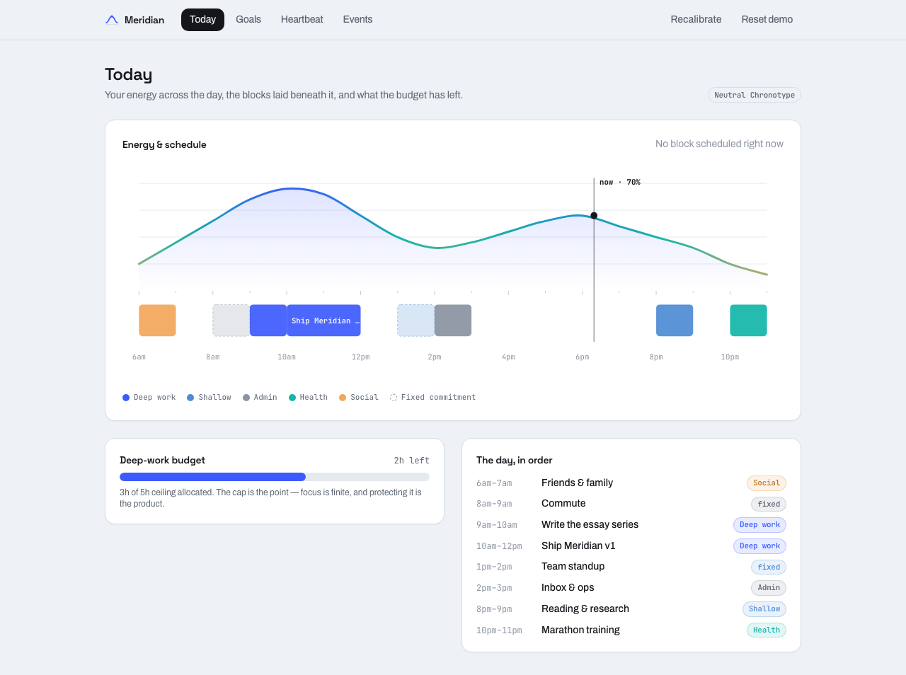
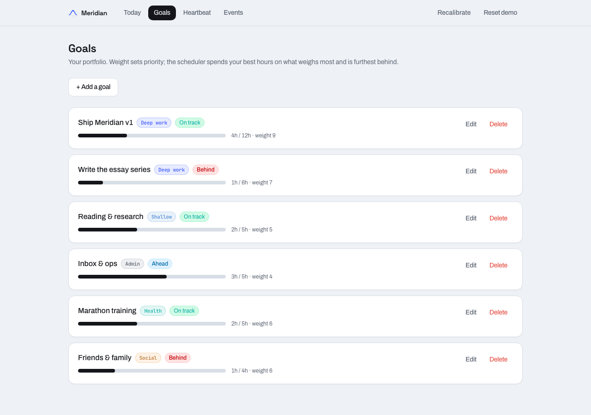
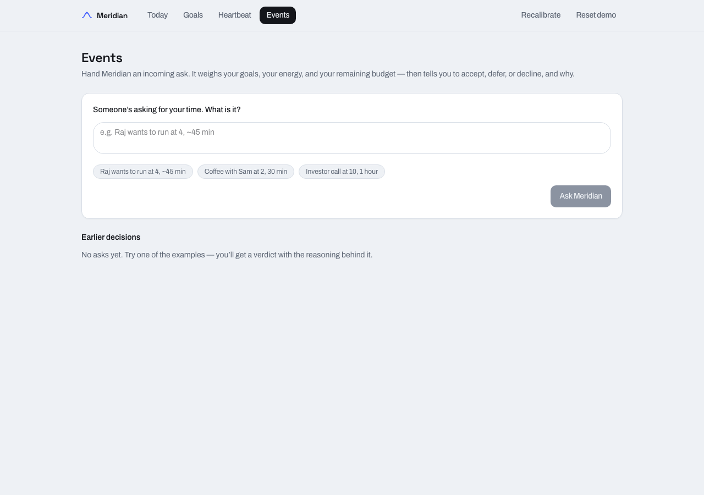
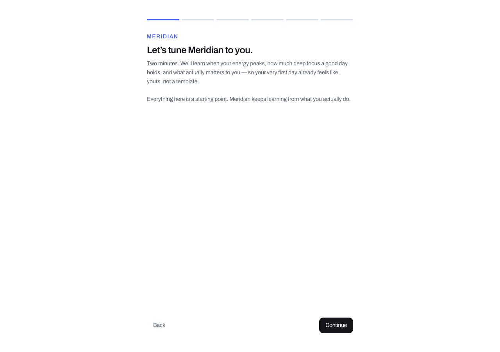

# Meridian

**An operating system for your attention.**

Meridian learns your personal energy curve and your follow-through, spends a
hard-capped deep-work budget (4–6 hours/day) on your highest-weight goals during
your peak hours, and routes everything else to your troughs. When an ask comes in —
_"a friend wants to run at 4"_ — it reasons about your goals, your energy, and your
remaining budget at once, and gets sharper about you every week.

## The thesis

Most productivity tools treat every hour as interchangeable and every task as
equally schedulable. They are not. Your capacity for deep work is finite (a few
genuinely focused hours a day) and it is unevenly distributed across the day. The
calendar sync and the interval check-in are plumbing. **The product is the
energy-aware decision engine** — the thing that knows a 4pm run is cheap in your
post-lunch trough but a 9am run would cost you the morning peak a behind-target
deep goal needs.

## Screenshots

**Today** — the signature: a data-driven energy curve rendered as a spectrograph
(indigo peaks → teal mid → amber troughs), the day's blocks settled on an
instrument baseline, a live `now · 70%` readout, and the deep-work budget meter.



| Goals                                | Events                                 | Onboarding                                     |
| ------------------------------------ | -------------------------------------- | ---------------------------------------------- |
|  |  |  |

### Design language

_"A spectrograph at rest."_ Meridian is a precision instrument for attention.
Cool paper canvas (`#EEF1F5`), ink-navy type, and a duotone energy spectrum
(`peak #3D5AFE` → `mid #12B5A8` → `trough #F2A65A`) that encodes energy as colour
temperature along the curve. Type: Space Grotesk (display), Archivo (body),
JetBrains Mono (data/timeline). Motion is one orchestrated page-load sequence on
Today (curve draws → blocks settle → budget fills), a breathing current-hour
marker, and a distinct LLM "thinking" state — all respecting
`prefers-reduced-motion`.

## Local setup

Prerequisites: **Node 20.19+ / 22.12+ / 24+**, **pnpm**, and **Docker** (for local
Postgres).

```bash
pnpm install

# Start local Postgres (docker-compose)
pnpm db:up

# Configure environment
cp .env.example .env.local   # then fill in values (see table below)

# Generate the Prisma client
pnpm prisma:generate

# Run the app
pnpm dev
```

Open <http://localhost:3000>.

> Every integration degrades gracefully if its key is missing: without
> `ANTHROPIC_API_KEY` the app uses the deterministic heuristic engine; without
> Google credentials it falls back to mock calendar data.

## Environment variables

| Variable               | Required       | Purpose                                                      |
| ---------------------- | -------------- | ------------------------------------------------------------ |
| `DATABASE_URL`         | Yes            | Postgres connection string (docker-compose default provided) |
| `ANTHROPIC_API_KEY`    | No (heuristic) | Enables the Claude-powered decision engine (else heuristic)  |
| `NEXTAUTH_SECRET`      | For auth       | Auth.js session secret (`openssl rand -base64 32`)           |
| `GOOGLE_CLIENT_ID`     | For calendar   | Google OAuth client ID (sign-in + Calendar scopes)           |
| `GOOGLE_CLIENT_SECRET` | For calendar   | Google OAuth client secret                                   |
| `CRON_SECRET`          | For cron       | Shared secret authenticating the nightly learning route      |

Copy `.env.example` → `.env.local` and fill in real values. `.env.local` is
gitignored; secrets never enter the repo.

## Scripts

| Script                   | Purpose                           |
| ------------------------ | --------------------------------- |
| `pnpm dev`               | Dev server                        |
| `pnpm build` / `start`   | Production build / serve          |
| `pnpm typecheck`         | `tsc --noEmit`                    |
| `pnpm lint`              | ESLint (flat config)              |
| `pnpm format`            | Prettier write                    |
| `pnpm test`              | Vitest unit + component tests     |
| `pnpm test:e2e`          | Playwright E2E                    |
| `pnpm db:up` / `db:down` | Local Postgres via docker-compose |
| `pnpm prisma:generate`   | Generate the Prisma client        |
| `pnpm prisma:migrate`    | Run a dev migration               |
| `pnpm prisma:studio`     | Open Prisma Studio                |

## Architecture

See [`CLAUDE.md`](./CLAUDE.md) for the domain glossary, conventions, and the
load-bearing seam (pure domain logic; one `DecisionEngine` interface shared by the
heuristic and LLM engines). Built with Next.js 15, TypeScript (strict), Tailwind v4,
Prisma + Postgres, Auth.js v5, and the Anthropic SDK. Deploys to Vercel.

## Testing

```bash
pnpm test          # Vitest: domain units, LLM contract, calendar, components (67 tests)
pnpm test:e2e      # Playwright: onboarding → ask → accept happy path + reduced-motion
pnpm typecheck && pnpm lint
```

External services are mocked throughout (Anthropic SDK, Google `fetch`); the suite
needs no API keys and no live database. CI (`.github/workflows/ci.yml`) runs
typecheck + lint + tests + build on every push and Playwright on PRs.

## Status

All six build phases complete — scaffold, V1 on mock data with the heuristic
engine, real integrations (Claude + Google Calendar + Postgres + nightly learning
cron), onboarding, the design language + motion pass, and the test suite. The app
runs end-to-end for free on the heuristic engine and lights up the LLM and calendar
when their env vars are present. See `CLAUDE.md` → _Current status_ for the detail.
